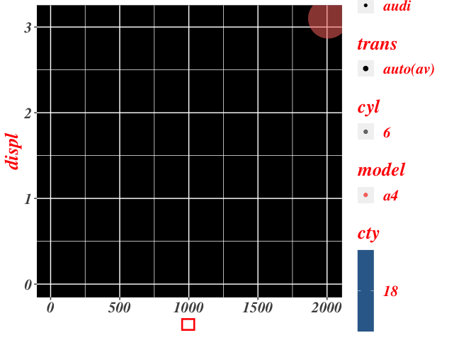

hmk_6
================
Bailey Morgan

## Homework 6: Bad Plot

``` r
library(tidyverse)

data <- filter(mpg, model == "a4", displ >= 3)
```

I used the mpg data set because it was easier than playing around with
real data. I also filtered the data down to one single observation
because that was the vision.

``` r
ggplot(data, aes(year, displ)) +
  geom_point(aes(alpha = cyl, color = model, fill = cty, shape = manufacturer,
                 size = trans, stroke = hwy)) +
  expand_limits(ymin = 0) +
  expand_limits(xmin = 0) +
  theme(panel.background = element_rect("black"),
        text = element_text(color = "red", size = 20,
                            face = "bold.italic", family = "Times")) +
  scale_x_continuous(name = "년")
```

    Warning: Using size for a discrete variable is not advised.



Wilke would likely call this plot ugly and bad. Is is bad because it is
trying to give too much information in a single graph and there is
really only one data point, so a graph really isn’t even necessary.
Tufte would say that this should be left in a table (p 33), and Wilke,
although not explicitly stated, would probably agree. It is also bad
because the titles and labels are either not very descriptive or missing
altogether (Wilke 22). I extended the limits on both axes to include the
origin, which is not necessarily bad but, for the x-axis, does not make
sense because we do not expect to see data on cars from the year 0
(which you wouldn’t know because the “year” label was coded to be in
Korean but R couldnt put that in the plot). Is it ugly because of all of
the garbage on the side of the plot, the font and style looks tacky, the
colors look bad (although that is subjective, my significant other like
the colors).

``` r
ggsave("badplot2.png", width = 5, height = 5, dpi = 40)
```

    Warning: Using size for a discrete variable is not advised.

I also took the opportunity to make the plot even worse by saving it at
a low resolution and a weird size that makes it even more difficult to
look at the point.
